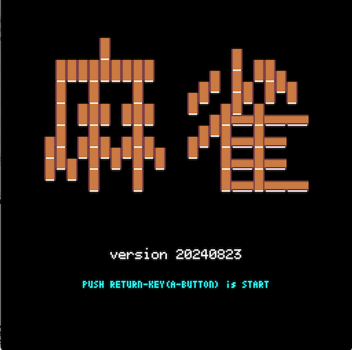

# 麻雀

## 概要
コンピュータ対戦二人麻雀 
AIほど頭は良くないコンピュータとの対戦麻雀。 
学習はしないけど性格や気分で打ち筋を変えてきます。 
キーボード、ジョイパッド、バーチャルゲームパッドに対応しています。 
キーボードは表示してあるキー、または上下左右＋Return/BSキーを使用 
効果音はfrenchbreadさん作成の「Pyxel RPG SE パック」を使用 

## スクリーンショット
  
  
  

## GIFアニメ

## 動作確認
- [URL](https://sanbunnoichi.web.fc2.com/pyxel/pyxelmj.html)

## 更新履歴
2024.08.22 新規追加
